<!-- Animated Header -->

  

<!-- Typing Animation -->

   

---

## 🌟 Who Am I?

> *A CS student in Dhaka who gets genuinely excited when a model converges — and equally excited when a deployed API actually works in production.*

I build things at the intersection of **machine learning** and **real-world problems** — from helping students navigate study abroad options, to detecting skin diseases with deep learning, to classifying invasive plants from drone footage. My projects tend to start with *"what if..."* and end with a working demo.

🔭 &nbsp;Wrapping up my undergrad at **East West University** (Spring 2026)  
🌱 &nbsp;Currently exploring **Computer Vision**, **NLP**, and **full-stack AI apps**   
🤝 &nbsp;Open to **internships**, **research collaborations**, and **interesting problems**  
📍 &nbsp;Based in **Dhaka, Bangladesh**

---

## 🧰 Stack & Skills

   
  

  
  
  
  
  
  
  
  
  
  
  
  
  
  

## 📊 GitHub Stats

    

  

---

## 🔗 Connect With Me

  
  
  

  

<!-- Footer Wave -->

